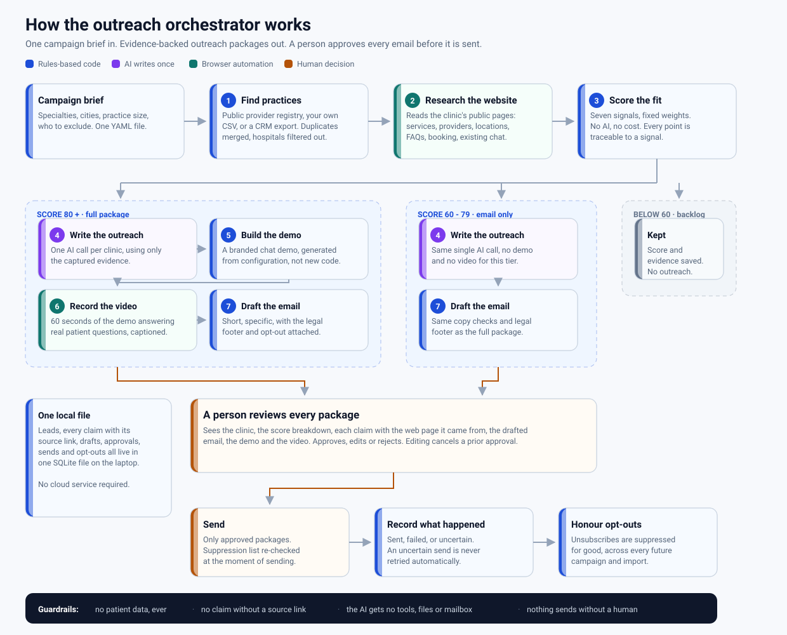
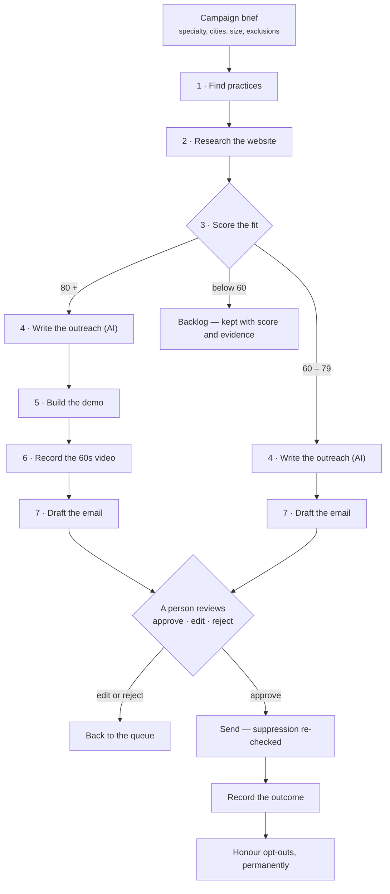

# How it works

A plain-language walkthrough for anyone who needs to understand, fund, or sign
off on this system without reading the code. Engineers should read
[TDD.md](TDD.md); the product scope is in [PRD.md](PRD.md).

---

## The one-paragraph version

You describe the kind of clinic you want to reach. The system finds matching
practices, reads their public websites, scores how good a fit each one is, and
for the best ones writes a short personalized email, builds a chatbot demo
branded to that clinic, and records a 60-second video of the demo answering
questions that clinic's own patients would ask. Everything then stops and waits
for a person to approve, edit, or reject it. Only approved emails are sent.

## Why it is a pipeline, not a swarm of agents

A popular way to build this would be several AI agents talking to each other and
deciding what to do next. We deliberately didn't. Agents negotiating among
themselves are slow, expensive, hard to debug, and produce different results
every run.

Instead this is an assembly line. Each station does one job, takes structured
input, and hands structured output to the next. **Exactly one station uses AI**
— the one that writes the outreach — and it runs once per qualified clinic.
Everything else is ordinary code with fixed rules. That makes runs cheap,
repeatable, and inspectable: when something looks wrong you can point at the
station that produced it.

## The stations

| # | Station | What it does | Who does it | Cost |
|---|---|---|---|---|
| 1 | **Find practices** | Pulls matching practices from the public provider registry, a CSV you supply, or a CRM export. Merges duplicate records, drops hospitals and universities. | Rules | Free |
| 2 | **Research the website** | Visits the clinic's public pages and notes services, providers, locations, published FAQs, whether they book online, and whether they already run a chat widget. Every fact is stored with the page it came from. | Automated browsing | Free |
| 3 | **Score the fit** | Seven signals with fixed weights — is this the right specialty, right size, do they publish FAQs, do they already have a chatbot, is there a contact address. | Rules | Free |
| 4 | **Write the outreach** | One AI call produces the angle, the patient questions for the demo, the email, and the video lines — using only the facts captured in step 2. | AI | One call per clinic |
| 5 | **Build the demo** | Generates a branded chat demo for that clinic from configuration. No new code is written per customer. | Rules | Free |
| 6 | **Record the video** | Drives the demo in a real browser, answering two patient questions, and records a captioned 60-second video. | Automated browsing | Free |
| 7 | **Draft the email** | Assembles the message with the legal footer, the postal address and the opt-out link. | Rules | Free |
| — | **Review** | A person sees everything and decides. | **Human** | — |
| — | **Send & track** | Sends approved messages, records what happened, and suppresses anyone who opts out. | Rules | Mail provider |

## Three lanes, by score

Not every lead is worth a video.

* **80 and above — full package.** Email, branded demo, and a 60-second video.
* **60 to 79 — email only.** The AI still writes a personalized email, but no
  demo and no video are produced. This keeps effort where it converts.
* **Below 60 — backlog.** Nothing is generated. The lead keeps its score and
  evidence so you can revisit it if the criteria change.

Scores are explainable: every lead stores which signals it earned and what each
was worth, so "why is this a 90?" has a concrete answer in the review screen.

## Where a human is required

The system cannot send anything on its own. That is a structural property, not
a setting: the send step only accepts packages a person moved to *approved*,
and an approval is tied to the exact wording and recipient that was reviewed.
Edit the email after approving it and the approval is cancelled automatically —
the package goes back into the queue.

Reviewers see the clinic, the score breakdown, every claim next to a link to
the web page it came from, the drafted email, the demo, and the video.

## What stops it from embarrassing you

**It cannot make things up about a clinic.** The AI is only shown facts that
were captured from that clinic's website, each with a source URL. Copy that
references anything outside that evidence — an invented service, a made-up
statistic, a claim about their revenue or staffing — is rejected and
regenerated. Marketing hype and fake familiarity ("as we discussed") are
blocked by the same check.

**It treats clinic websites as hostile input.** Anyone can put text on a web
page, including instructions aimed at an AI reading it. Website text is
stripped of anything resembling a command, wrapped in a clearly labelled data
envelope, and — most importantly — the AI has no tools, no file access, no
mailbox and no credentials. Even a perfectly crafted instruction on a clinic's
page has nothing to act on.

**It handles no patient data.** Only public business information about the
practice is collected. Demo conversations are synthetic, the demo declines to
give medical advice, and every demo page is labelled as a demonstration.

**It respects opt-outs permanently.** Unsubscribes are recorded and checked
again at the moment of sending, and they survive future campaigns and imports.
Every email carries a postal address and an opt-out, as US commercial email law
requires — those are added by the system, never written by the AI.

## What it costs to run

Effectively nothing per lead. Discovery, research, scoring, demo building,
video recording and email assembly are all ordinary code running on a laptop,
against free public data. The only metered resource is a single AI call per
qualified clinic, and validated results are cached so a later failure never
pays for the same work twice. There is no cloud infrastructure and no database
server: the whole state of a campaign is one file.

## What it deliberately does not do

It doesn't diagnose patients, touch patient records, send at volume without
supervision, or maintain a CRM. It doesn't rebuild the product for each
customer — the demo is configuration, not a fork. And it doesn't guess: a lead
whose website can't be found stays marked as incomplete rather than being
researched against a domain that might belong to someone else.

Known limits are listed honestly in [CONFORMANCE.md](CONFORMANCE.md), including
the five requirements from the technical design that are not yet met.

---

## The diagram as text

For editing or embedding elsewhere — GitHub renders this natively.

The picture above is generated by `docs/build_architecture.py`; edit that
script and re-run it rather than hand-editing the SVG.
